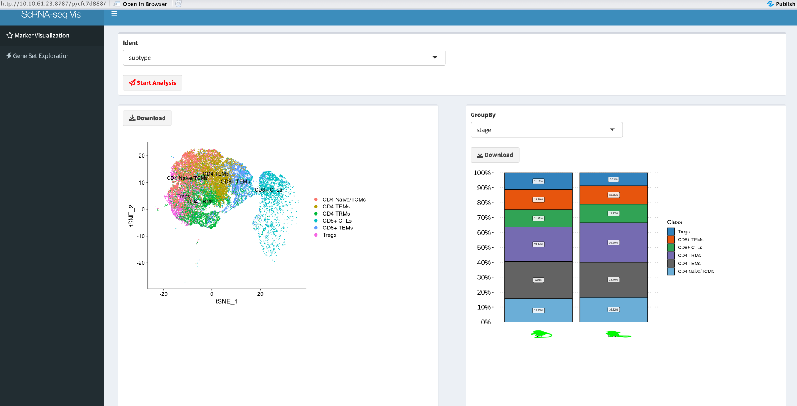
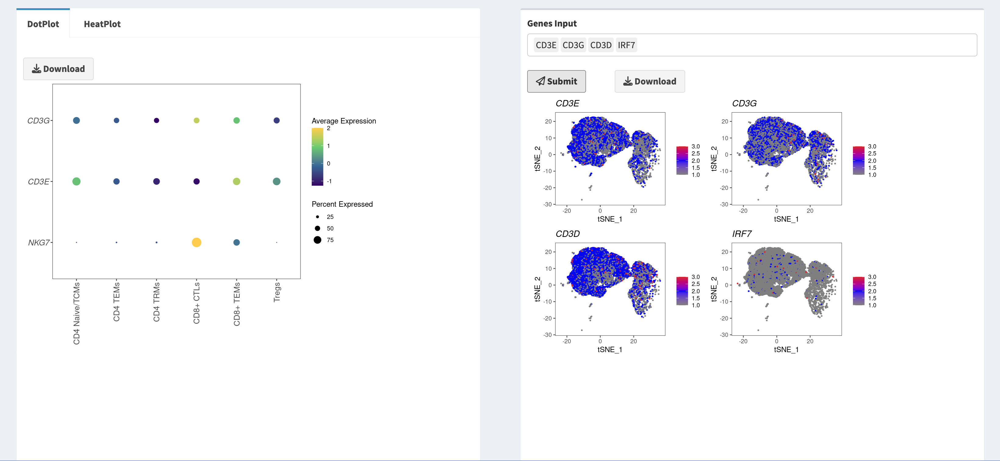
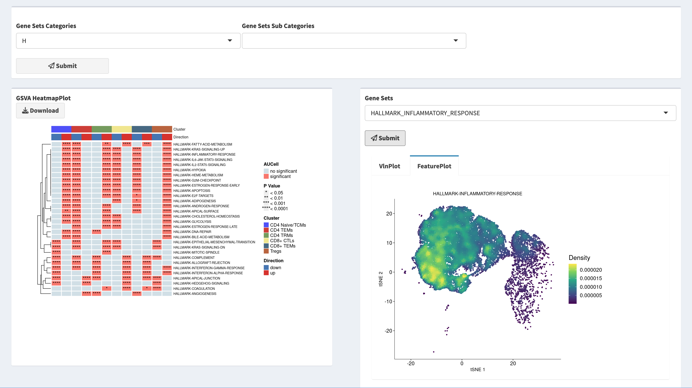

---
scrnaVis Tutorial 
---
### install 
`devtools::install_github("jackxiong2020/scrnaVis")`

### run seurat pipeline
`run_seurat_pipline(object,runSCTransform=T,runHarmony=TRUE)`

### Interactively explore your scRNA-seq data with shiny web
`scrnaVis(object,markers)`

### TODO first
- choosing the ident you want to group for your scRNA-seq data
- clicking start and then it works

### Graphs
- The first plot is a tSNE that is colored based on the primary ident selected
- The second plot is a proportion group by a new ident match pirmary ident you selected before

- The third plots helps to explore sets of genes and their relation to the identity base on DotPlot and HeatmapPlot
- The fourth plots helps to explore set of genes localization in cell groups but your need to enter genes manually and click submit

- The fifth plots helps to explore gene sets in MSigDB among the levels of ident
- The sixth plots helps to explore single gene set localization in cell groups and your need to enter gene set manually adn click submit

